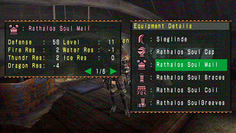

# MHFU Transmog

Change the visual appearance of weapons and armor in Monster Hunter Freedom Unite (with [FUComplete](https://github.com/FUComplete/FUComplete) mod) without affecting stats.

Works on PPSSPP and real PSP hardware via CWCheat codes.

Tested with FUComplete v1.4.0

## How It Works

The game stores equipment data in static memory tables. Each armor/weapon entry contains a model ID that determines its 3D appearance. CWCheat codes overwrite these model IDs at runtime, making one piece of equipment look like another while keeping the original stats. NOTE: Transmog is client-side only — other players in multiplayer will still see your original equipment.

## Proof

By using the below example cheat codes, the Iron Katana will look like the Hellish Slasher. Similarly, the Mafumofu armor visuals will change to a mix of the Black armor pieces (blademaster arms, gunner body & wasit & legs) with an invisible head.

The stats stay the same as the original equipment, only the visuals change! This also works with upraded armors, decorations, etc. because it really only changes the model ID that the game reads when rendering your character.



## Examples

The below cheat code change the Iron Katana (and all of its versions) to the Hellish Slasher (and all of its versions):
```
_C1 Iron Katana -> Hellish Slasher
_L 0x101575B8 0x0000008A
_L 0x101575D0 0x0000008A
_L 0x101575E8 0x0000008A
_L 0x1015B590 0x0000008A
```

The below cheat code changes the Mafumofu armor so that the head slot is invisible and the remaining armor parts are a mix of the blademaster and gunner versions of the Black armor:
```
_C1 Mafumofu -> Black B/G Mixed
_L 0x20162EB0 0x00000000
_L 0x20167140 0x00300030
_L 0x2016B218 0x002E002E
_L 0x2016F228 0x00220024
_L 0x201731E8 0x00230023
```

You will have to trigger a re-render (e.g. by unequipping and re-equipping the armor/weapon) to see the changes take effect. If you want to undo the transmog, simply disable the cheat and reload the game. You can also use a different transmog cheat to overwrite the previous one.

## Requirements

- Python 3.6+
- MHFU with FUComplete mod (game ID: ULJM05500)
- PPSSPP (or real PSP with CWCheat support)

## Setup

Clone the repo and run `python transmog.py` — no installation needed. The equipment data (`transmog_data.json`) is included.

### Regenerating the data file

Only needed if FUComplete updates its equipment tables:

1. Place your FUComplete MHFU ISO in the `data/` folder and extract the game files:

```bash
python extract_iso.py
```

2. Launch the game in PPSSPP and create a save state (slot 0).

3. Build the data file:

```bash
pip install -r requirements.txt
python build_data.py
```

This scrapes equipment names from the [FUComplete docs](https://fucomplete.github.io/files_doc/player/player_asset.html) and reads armor/weapon tables from the PPSSPP save state at `~/Documents/PPSSPP/PSP/PPSSPP_STATE/`.

## Usage

```bash
python transmog.py
```

The tool offers three modes:

- **Weapon Transmog** — change a weapon's appearance
- **Armor Transmog** — change a single armor slot's appearance
- **Full Set Transmog** — guided flow for weapon + all 5 armor slots, with a persistent search filter across selections

For each selection you can search by name or browse an alphabetical list with pagination. Armor targets include an "Invisible" option (shows hair for head, hides the piece for other slots).

Generated codes are printed to the terminal and can optionally be appended to the PPSSPP cheat file at `~/Documents/PPSSPP/PSP/Cheats/ULJM05500.ini`.

### Example Output

```ini
_C1 Armor Transmog: Rathalos Soul Cap U -> Black Face (invisible head)
_L 0x20161718 0x00000000
_L 0x20161740 0x00000000
_L 0x20165AE8 0x002F002F
_L 0x20165B10 0x00300030
...

_C1 Weapon Transmog: Sieglinde G -> Black Fatalis Blade
_L 0x10157810 0x000000F2
_L 0x10157828 0x000000F2
_L 0x1015B6B0 0x000000F2
```

After enabling the cheat in PPSSPP, unequip and re-equip the armor/weapon to trigger a model reload.

## Technical Details

See [FINDINGS.md](FINDINGS.md) for the full reverse-engineering documentation, including memory table layouts, address calculations, and known pitfalls.

## TODO

- [ ] improve usability of the transmog script

